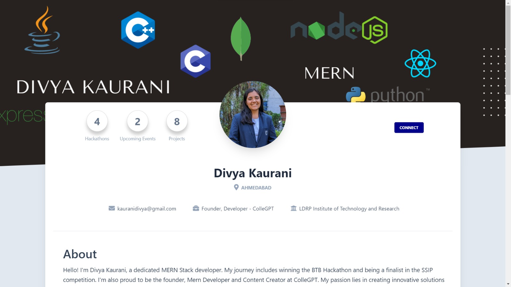
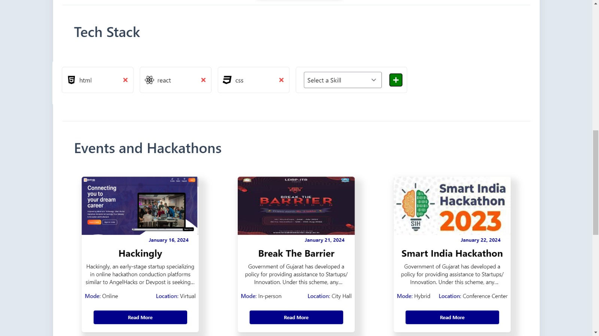

# Profile Page

Track the fascinating journey from any Wikipedia page to the ultimate destination - the "Philosophy" page.



## Overview

This project is a responsive React-based profile page designed for the frontend assignment of Hackingly. It showcases a clean UI, is optimized for speed, and has been deployed for easy access.

## Project Structure

```plaintext
hackingly/
├── public/
├── src/
│   ├── components/
|   |   ├── images/
│   │   |   ├── EventCard.jsx
│   │   |   ├── ProjectCard.jsx
│   │   |   └── TechStack.jsx
│   │   ├── App.js
│   │   └── App.css
│   ├── package.json
│   └── ...
├── package.json
├── README.md
└── ...
```

## Features
### Responsive Design


The profile page is built with responsiveness in mind, ensuring a seamless experience across various devices and screen sizes.

### Clean UI


The user interface is designed with simplicity and clarity, providing a visually appealing and user-friendly experience.

### Fast Performance


The project has been optimized for speed, ensuring quick loading times and a smooth browsing experience.

### Deployment


The profile page is deployed, making it easily accessible for review and assessment.

 
## Installation

1. **Clone the repository:**

   ```bash
   git clone https://github.com/KauraniDivya/
   ```

2. **Navigate to the project directory:**

   ```bash
   cd hackingly
   ```

3. **Install dependencies:**

   ```bash
   npm install

   ```
## Getting Started


1. **Start the React app:**

   ```bash
   cd hackingly 
   npm start
   ```

The application will be accessible at [http://localhost:3000](http://localhost:3000).


## Contact

Your Name - Divya Kaurani (https://www.linkedin.com/in/divyakaurani/)

Project Link: [https://github.com/your-username/wikipedia-philosophy-tracker](https://github.com/your-username/wikipedia-philosophy-tracker)


